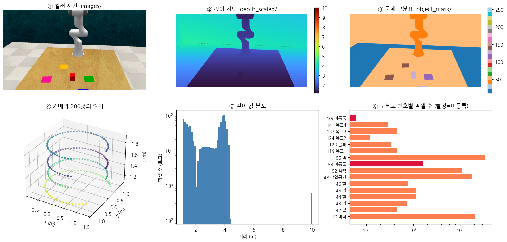

# 001. 샘플 데이터 분석

작성: 2026-09-14
대상: `data/slide_block_to_color_target_episode0_start/` (2.1 GB)
출처: https://huggingface.co/datasets/leobarcellona/DreMa_data → `sample_slide_block.tar`



---

## 사전지식

처음 보면 낯선 용어 5개만 먼저 정리한다.

| 용어 | 뜻 | 비유 |
|---|---|---|
| **가우시안 스플래팅** | 3D 공간을 수십만 개의 작은 색깔 물방울로 표현하는 기술 | 점묘화. 물감 점을 잔뜩 찍어 그림을 만든다 |
| **깊이 지도(depth)** | 각 픽셀이 카메라에서 얼마나 먼지 적어둔 표 | 사진 위에 "여기는 2m, 저기는 4m"라고 적어둔 것 |
| **마스크(mask)** | 각 픽셀이 어떤 물체인지 번호로 적어둔 표 | 색칠공부 도안. 영역마다 번호가 매겨져 있다 |
| **URDF** | 로봇·물체의 모양과 무게를 적은 설계도 파일 | 가구 조립 설명서 |
| **2DGS / 3DGS** | 물방울이 납작한 원판이냐(2D) 공이냐(3D) | 동전 vs 구슬 |

---

## 1. 데이터는 얼마나 되나

> **한 줄 요약: 시범 동작 "딱 1개"다.**

| 구분 | 수량 |
|---|---|
| 과제(task) | **1개** — `slide_block_to_color_target` (블록을 색깔 목표로 밀기) |
| 에피소드 | **1개** — episode 0 |
| 장면 사진 | **200장** (같은 장면을 200군데서 촬영) |
| 로봇 동작 | **90스텝** → 코드가 앞 30을 버려서 **실제 60스텝** |
| 조작 대상 물체 | **1개** — `block` (빨간 블록) |
| 전체 용량 | **2.1 GB** |

**200장은 "200개의 다른 장면"이 아니다.** 정지한 똑같은 장면을 카메라가 빙 돌면서 200번 찍은 것이다. 그림 ④를 보면 카메라가 3~4겹의 원을 그리며 배치돼 있다. 중심에서 평균 1.05 m 거리다.

> [공학적 정의] 가우시안 스플래팅은 여러 시점의 2D 이미지로부터 3D 장면을 역산한다. 시점이 많고 고르게 분포할수록 복원 품질이 올라간다.
> [비유] 물체를 한 방향에서만 보면 뒤통수를 모른다. 빙 돌면서 봐야 전체 모양을 안다. 200장은 그 "빙 돌기"다.

---

## 2. 어떤 속성이 들어 있나

| 폴더/파일 | 개수 | 용량 | 내용 |
|---|---|---|---|
| `images/` | 200 | 180 MB | 컬러 사진 **1280×720**, PNG |
| `depth_scaled/` | 200 | **1.4 GB** | 깊이 지도, float64, 단위 m |
| `depth/` | 200 | 132 MB | 깊이 사진(PNG) — **코드가 안 씀** |
| `object_mask/` | 200 | 2.4 MB | 물체 번호표, uint8 |
| `poses/` | 400 | 1.6 MB | 카메라 위치·렌즈 정보 (200 + near/far 200) |
| `labels.txt` | 1 | 364 B | 번호 ↔ 이름 대응표 (17줄) |
| `dictionary.pkl` | 1 | 321 KB | **로봇 궤적** 90스텝 |
| `output/` | 14 | 346 MB | **이미 만들어둔 3D 복원 결과** |
| `low_dim_obs.pkl` 외 2 | 3 | 397 KB | RLBench 원본 기록 |

### 궤적(`dictionary.pkl`) 한 스텝에 든 것 — 28개 항목

```
로봇 : gripper_pose(위치3+자세4) · gripper_open · joint_positions(7)
       joint_velocities(7) · joint_forces(7) · gripper_joint_positions(2)
카메라: front / left_shoulder / right_shoulder / overhead / wrist   ← 5대
       각각 extrinsics(4×4) · intrinsics(3×3) · near · far
```

동작 내용: 그리퍼가 **0.947 m** 이동하며, **70번째 스텝에서 한 번 닫힌다.** 높이는 0.76 m → 1.47 m 범위다.

---

## 3. 무엇을 위한 데이터인가

DreMa의 목표는 **"시범 1개를 여러 개로 뻥튀기하는 것"** 이다.

```
[200장 사진]  ──재구성──>  [3D 가우시안 장면]
                                  │
[90스텝 궤적] ─────────────────────┤
                                  ↓
                       물체·환경을 돌리고 옮겨서
                                  ↓
                    [최대 37개의 새로운 시범]  ──> PerAct 학습
```

> [공학적 정의] 로봇 모방학습은 사람 시범 데이터를 필요로 하는데, 수집 비용이 매우 비싸다. DreMa는 장면을 3D로 복원한 뒤 물리 시뮬레이터 안에서 물체 배치를 바꿔 가상의 시범을 합성한다.
> [비유] 요리를 한 번만 배웠는데, 머릿속에서 "재료 위치가 달랐다면?"을 수십 번 상상해 연습하는 것이다. 실제로 다시 배우지 않아도 실력이 는다.

**`output/` 폴더가 핵심이다.** 3D 복원이 이미 끝나 있어서, 몇 시간 걸리는 재구성 단계를 건너뛰고 바로 다음 단계로 갈 수 있다.

---

## 4. 하자는 없나

### ✅ 정상인 것

| 항목 | 확인 결과 |
|---|---|
| 파일 개수 일치 | images / depth_scaled / object_mask / poses **모두 200개, 이름 완전 일치** |
| 파일 무결성 | tar 크기가 원본과 바이트 단위로 일치, 항목 1232개 정상 |
| `output/` 완비 | 코드가 요구하는 파일 **8종 전부 존재** |
| 2DGS 통일 | `output/`의 가우시안이 전부 2DGS → 저장소 동봉 로봇 자산(2DGS)과 **종류 일치** |
| 파일명 8자 규칙 | 코드가 `poses/`에서 8자 파일만 읽는데, `0000.txt`(8자) 통과 / `0000_near_far.txt` 자동 제외 — **의도된 설계** |

> 2DGS 통일은 중요하다. 코드는 PLY 파일의 채널 수로 2DGS인지 3DGS인지 자동 판단하는데, 둘을 섞으면 실행 즉시 오류가 난다. 이 데이터는 섞이지 않았다.

### ⚠️ 주의할 것

| # | 문제 | 영향 |
|---|---|---|
| 1 | **`depth_scaled`가 float64** → 1.4 GB로 **전체의 68%** | float32로 바꾸면 700 MB 절약. 정밀도 손실 없음 |
| 2 | **`depth/` 132 MB를 코드가 안 씀** | 이를 읽는 설정은 죽은 코드에만 연결돼 있음. 삭제 가능 |
| 3 | 마스크에 **53, 56, 255번**이 있는데 이름표에 없음 | 정체 불명 영역. 255는 배경으로 추정되나 근거 없음 |
| 4 | `labels.txt`에서 **목표 4개(119·124·137·141)가 삭제**됨 | 조작 대상이 **블록 1개뿐**. 색깔 목표판은 배경 취급 |
| 5 | **초점거리가 음수** (fx = fy = −1108.51) | CoppeliaSim 관례. 부호를 잘못 다루면 좌우/상하 반전 |
| 6 | `low_dim_obs.pkl`은 **RLBench 없이 못 엶** | DreMa는 복사만 해서 무방. **PerAct 단계에서 RLBench 필요** |
| 7 | 설정의 경로가 **실제 폴더명과 다름** | `config.yaml`을 실제 이름으로 고쳐야 실행됨 |

**4번을 조금 더 본다.** 원본 이름표(`labels_original.txt`)에는 물체가 5개(블록 + 목표 4개)인데, 실제 쓰는 이름표에서 목표 4개가 빠졌다. 목표판은 식탁에 붙은 납작한 색종이라 집거나 밀 수 없기 때문으로 보인다. **결과적으로 "움직일 수 있는 물체"는 블록 하나뿐이고, 증강도 이 하나를 기준으로 일어난다.**

---

## 5. 그 밖에 알아둘 것

- **과제 설명문이 들어 있다.** `variation_descriptions.pkl` → `"slide the block to green target"` 등 여러 표현. PerAct가 언어 지시를 받는 모델이라 이것이 학습 입력이 된다.
- **깊이 최대값이 정확히 10.000 m**다. 그림 ⑤의 오른쪽 끝 막대가 그것인데, 전체의 0.1% 뿐이다. 멀리 잘린 배경이며 문제 되지 않는다.
- **이 데이터로 논문 수치는 재현할 수 없다.** 에피소드 1개짜리 맛보기다. 논문 재현에는 같은 저장소의 `val.tar.gz`(13 GB)·`test.tar.gz`(16 GB)가 추가로 필요하다.
- **원래 공식 링크(Google Drive·OneDrive)는 둘 다 죽었다.** HuggingFace가 유일한 경로다.

---

## 요약

> **① 얼마나** — 과제 1개, 시범 1개. 사진 200장 + 동작 90스텝. 총 2.1 GB.
> **② 무엇이** — 컬러·깊이·마스크·카메라정보 + 로봇 궤적(카메라 5대) + **이미 완성된 3D 복원 결과**.
> **③ 왜** — 시범 1개를 3D로 복원해 물체를 돌리고 옮겨서 **최대 37개 가상 시범으로 불리기** 위함.
> **④ 하자** — 치명적 결함 **없음**. 파일 정합성·무결성·2DGS 일치 모두 정상.
> 다만 **용량 낭비(float64로 1.4 GB, 미사용 132 MB)**, **이름표 누락(53·56·255)**, **설정 경로 불일치** 3가지는 손봐야 한다.
> **⑤ 다음** — `config.yaml` 경로 수정 → 실행 시도. 논문 수치 재현은 별도 29 GB 데이터가 더 필요하다.
