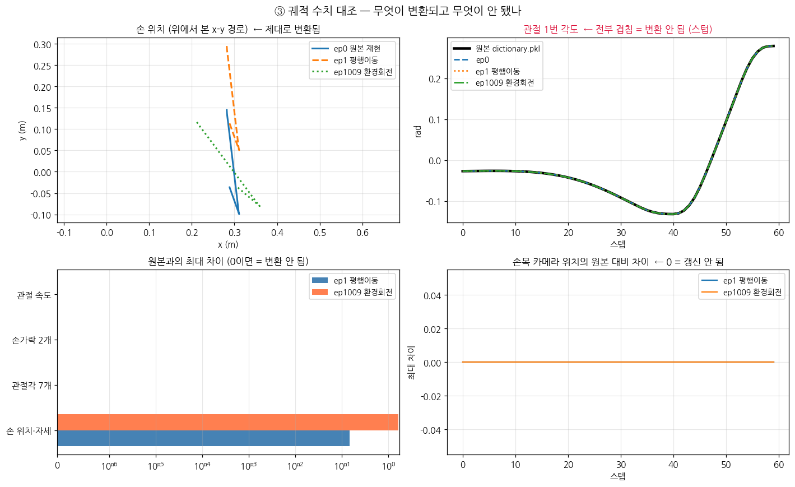
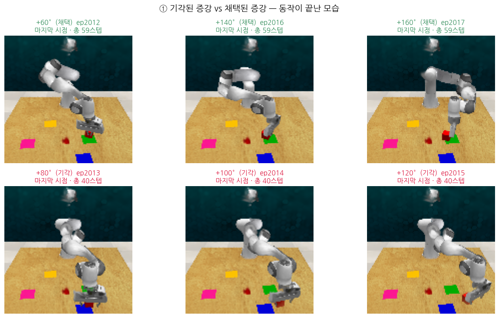
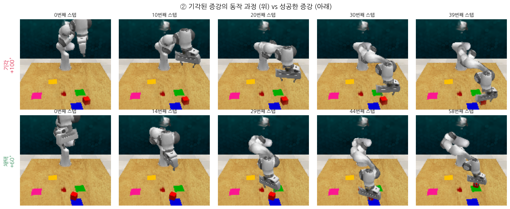
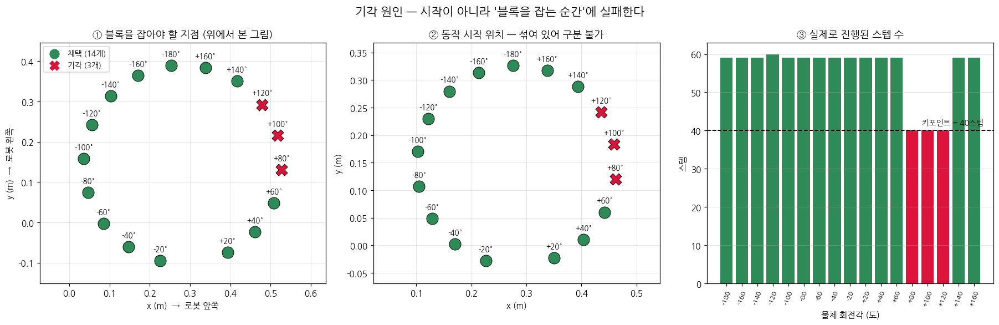

# 002. 증강 결과 검증 (M1)

작성: 2026-09-19
대상: `data/generated_data/slide_block_to_color_target_episode0_start/`
실행 로그: `run_logs/20260918_2046_m1_generate.log`

---

## 사전지식

| 용어 | 뜻 | 비유 |
|---|---|---|
| **PSNR** | 두 사진이 얼마나 같은지 재는 숫자(dB). 높을수록 똑같음 | 시험 점수. 30점대면 "잘 그렸다" |
| **증강 기각** | 만든 시범이 물리적으로 이상하면 버리는 것 | 불량품 검사 |
| **스텁** | 함수 껍데기만 있고 내용이 빈 것 | 문패만 걸린 빈 가게 |

---

## 0. 한 줄 결론

> **사진은 잘 만들어졌다. 그런데 기록표(숫자)는 절반만 고쳐졌다.**

---

## 1. 얼마나 만들어졌나

| 항목 | 값 |
|---|---|
| 에피소드 | **34개** (원본 1 + 증강 33) |
| 기각된 증강 | **3건** |
| 소요 시간 | **19분** (31초/개) |
| 용량 | 710 MB |
| 종료 코드 | 0 (정상) |

증강 종류별:

| 종류 | 계획 | 생성 | 번호 |
|---|---|---|---|
| 평행이동 | 8 | **8** | ep1~8 |
| 환경 회전 | 11 | **11** | ep1009~1019 |
| 물체 회전 | 17 | **14** | ep2020~2036 |

→ 물체 회전에서만 3건이 기각됐다. **블록을 특정 각도로 돌려 밀었더니 예상과 다른 곳으로 굴러가서** 버린 것이다. 잘못된 시범으로 로봇을 가르치지 않으려는 안전장치가 작동했다.

---

## 2. ① 증강본 비교 — 의도대로 작동함


| 증강 | 확인된 동작 |
|---|---|
| 평행이동 | 식탁·색깔판이 통째로 옆으로 이동. 로봇은 제자리 ✅ |
| 환경 회전 | 색깔판 배치 전체가 회전 ✅ |
| 물체 회전 | 색깔판만 회전, 식탁은 고정 ✅ |

**눈에 보이는 결함 2가지**

| 결함 | 원인 |
|---|---|
| 로봇 팔이 **반투명·뭉개짐** | 배경은 사진 200장으로 정밀 복원했지만, 로봇은 **미리 만든 부품 11개를 관절에 맞춰 조립**하는 방식이라 이음새가 벌어진다 |
| 공중에 **검은 얼룩** | 복원 과정에서 생긴 떠다니는 잔여 가우시안 |

> 이는 논문 방식 자체의 한계이며, 저자도 이 상태로 논문을 냈다.

---

## 3. ② 복원 품질 — 매우 좋음


**[공학적 정의]** 200장의 실제 사진으로 만든 3D 장면을, 원본 사진과 **똑같은 카메라 위치**에서 다시 그려 원본과 비교했다. 차이가 작을수록 복원이 충실하다.

**[비유]** 초상화를 같은 각도의 사진과 겹쳐 보는 것이다. 겹쳐서 어긋남이 없으면 잘 그린 것이다.

| 시점 | PSNR |
|---|---|
| 0000 | 33.1 dB |
| 1065 | 31.8 dB |
| 2134 | 31.6 dB |
| **평균** | **32.2 dB** |

→ 30 dB를 넘으면 육안으로 거의 구별이 안 되는 수준이다. **복원은 신뢰할 만하다.**

차이 지도(오른쪽 열)를 보면 **오차가 물체 가장자리에만 몰려 있다.** 넓은 면(식탁·벽)은 거의 완벽하다. 경계선이 살짝 번지는 것은 가우시안 방식의 일반적 특성이다.

> 이것이 가장 중요한 검증이었다. 복원이 나빴다면 그 위에 쌓은 증강 33개가 전부 무의미했을 것이다.

---

## 4. ③ 궤적 수치 대조 — 절반만 변환됨 ⚠️



**원본과의 최대 차이** (0이면 = 전혀 안 바뀜):

| 항목 | 평행이동(ep1) | 환경회전(ep1009) | 판정 |
|---|---|---|---|
| **손 위치·자세** | 0.150 | 1.643 | ✅ 변환됨 |
| 관절각 7개 | **0.000** | **0.000** | ❌ **원본 그대로** |
| 손가락 2개 | **0.000** | **0.000** | ❌ **원본 그대로** |
| 관절 속도 | **0.000** | **0.000** | ❌ **원본 그대로** |
| 손목 카메라 | **0.000** | **0.000** | ❌ **원본 그대로** |

코드 분석 때 예측했던 **`update_trajectory_with_current_data()` 스텁**의 영향이 그대로 확인됐다.

```python
def update_trajectory_with_current_data(self):
    #if self.trajectory is not None:
        #self.trajectory.update_with_current_data(...)
    pass          # ← 아무것도 안 함
```

> **[비유]** 무대를 30도 돌려놓고 새로 촬영했는데, **대본은 예전 것을 그대로 첨부**한 셈이다. 배우의 동선(손 위치)은 고쳐 적었지만 팔다리 각도는 안 고쳤다.

### 그림에서 보이는 증거

- **왼쪽 위**: 손 위치 경로가 증강마다 확실히 다른 곳으로 간다 → 변환됨
- **오른쪽 위**: 관절 1번 각도 곡선 4개가 **완전히 겹친다** → 변환 안 됨
- **왼쪽 아래**: 막대가 "손 위치"에만 있고 나머지는 0
- **오른쪽 아래**: 손목 카메라 차이가 **일직선 0**

### 이게 문제가 되는가

**아직 단정할 수 없다.** PerAct가 학습에 쓰는 핵심 신호는 `gripper_pose`이고 **그건 제대로 변환된다.** 관절각을 PerAct가 실제로 읽는지는 **M2에서 RLBench 변환 스크립트를 봐야** 확정된다.

다만 손목 카메라는 문제 소지가 있다. 렌더링할 때는 위치를 갱신하는데 **저장되는 기록표에는 갱신하지 않아서**, 사진과 기록표가 서로 어긋난다.

---

## 5. 그 밖에 알게 된 것

- **순환 참조가 실제로 터졌다.** 001에서 "잠재적 지뢰"로 기록해둔 문제다. `drema.environment.observer.camera`를 먼저 불러오면 실패하고, `drema.environment.builder`를 먼저 불러오면 정상이다. 기록해둔 덕에 원인 파악이 빨랐다.
- **손목 카메라 사진도 생성된다.** 렌더링이 고장났다고 알려져 있으나 파일 자체는 만들어진다. 논문은 이 카메라를 빼고 3대만 썼다.
- **RLBench 없이 증강이 된다.** 컨테이너에 RLBench가 없는데도 정상 동작했다. 증강은 PyBullet + 가우시안 렌더링만으로 이뤄진다.

---

## 요약

> **① 사진**: 증강 3종 모두 의도대로 작동. 34개 생성(기각 3건), 19분 소요.
> **② 복원**: **평균 PSNR 32.2 dB로 매우 양호.** 오차가 물체 가장자리에만 몰려 있다. 증강의 토대가 튼튼하다는 뜻이다.
> **③ 궤적**: **손 위치만 변환되고 관절각·손목카메라는 원본 그대로.** 예측했던 스텁 문제가 수치로 확정됐다.
> **다음**: 이 불일치가 PerAct 학습에 영향을 주는지는 **M2에서 RLBench 변환 스크립트를 확인**해야 판정할 수 있다.

---
---

# 부록 A. 기각된 증강 3개 되살려 보기

추가: 2026-09-19
계기: "기각된 데이터도 눈으로 보고 싶다"

---

## A-1. 기각된 것은 저장되지 않는다

코드를 확인한 결과, 조건 미달이면 **화면까지 다 그려놓고 버린다.**

```python
if 오차 < threshold:
    save_images(...)                          # 저장
else:
    print("Error in the final positions")     # 출력만 하고 버림
```

→ 그래서 `generated_data/`에는 34개만 남았다.

## A-2. 되살린 방법

**코드를 고치지 않고 설정만 덮어썼다.**

```bash
threshold=999                  # 기준을 무한대로 → 전부 채택
translate_environment=False    # 물체회전만 실행 (시간 절약)
rotate_environment=False
generated_data_path=./data/generated_rejected_check   # 기존 34개 보호
```

결과: 17개 전부 저장(`data/generated_rejected_check/`). 기존 결과는 건드리지 않았다.

## A-3. 기각된 것은 +80° · +100° · +120°

| 회전각 | 오차 (기준 0.035 m) |
|---|---|
| +80° | 0.19164481 m |
| +100° | 0.19164487 m |
| +120° | 0.19164533 m |

**세 값이 소수점 7자리까지 같다.** 각도가 40도씩 다른데 오차가 같다는 것은, 각자 다르게 실패한 게 아니라 **셋 다 똑같은 상태로 끝났다**는 뜻이다.

---

## A-4. 원인 — 로봇 팔이 닿지 않았다



**결정적 증거는 스텝 수다.**

| | 스텝 수 |
|---|---|
| 채택된 14개 전부 | **59** |
| 기각된 3개 | **40** ← 중간에 끊김 |

기각된 것만 동작이 40스텝에서 멈췄다. 끝까지 가지 못했다.



- **성공(+60°, 아래줄)**: 블록이 로봇 앞에 있다 → 팔이 내려와 잡고 초록 판으로 민다 → 58스텝 완주
- **기각(+100°, 위줄)**: 블록이 오른쪽 끝으로 갔다 → 팔이 계속 뻗다가 **거의 다 펴진 채 39스텝에서 멈춤**

> [공학적 정의] 로봇 팔은 관절 각도 조합으로 도달 가능한 공간(작업 영역)이 정해진다. 목표가 그 밖이면 역기구학(IK)이 해를 못 찾고, 코드는 정해진 횟수 안에 도달 실패 시 시범 전체를 중단한다.
> [비유] 식탁 맞은편 끝의 소금통을 앉은 채로 집으려는 것과 같다. 아무리 뻗어도 닿지 않으면 포기한다.

**오차가 셋 다 같았던 이유**: 블록을 건드리지도 못해 제자리에 남았다. 0.19 m는 블록이 원래 이동했어야 할 거리다. "아무 일도 안 일어남"이 똑같으니 오차도 같다.

**연속된 각도대가 통째로 기각된 것도 타당하다.** 도달 불가 영역은 한 각도가 아니라 **부채꼴 구간**으로 이어지기 때문이다.

---

## A-5. 결론

```
+80°~+120° 회전  →  블록이 팔 닿는 범위 밖으로 이동
                 →  로봇 도달 실패, 40스텝에서 중단
                 →  블록 안 움직임 (오차 0.19 m > 기준 0.035 m)
                 →  기각
```

**검증 장치가 의도대로 작동했다.** 이 3개를 학습에 넣었다면 로봇은 *"블록 근처에 가지도 않고 팔만 휘젓는 것"* 을 올바른 동작으로 배웠을 것이다.

---

## 부록 요약

> **기각된 증강은 저장되지 않는다.** 렌더링까지 해놓고 버린다.
> `threshold=999`로 재실행해 **별도 폴더에 되살렸다.** 기존 34개는 그대로다.
> 기각된 것은 **+80°·+100°·+120°** 세 각도이고, 원인은 **로봇 팔 도달 실패**다. 정상 59스텝인데 **40스텝에서 중단**됐다.
> **검증 장치는 제대로 작동했다.** 물리적으로 불가능한 시범을 걸러냈다.

---
---

# 부록 B. 기각된 증강은 "왜" 실패했나 — 정밀 추적

추가: 2026-09-19
부록 A에서 "로봇 팔 도달 실패"까지 밝혔다. 여기서는 **어느 지점에서, 왜** 실패했는지 좌표로 특정한다.

---

## B-1. 결론 먼저

> **시작 위치 문제가 아니다.** 로봇은 40스텝까지 정상적으로 움직인다.
> **블록을 잡으려고 손을 내리는 바로 그 순간(키포인트)** 에 실패한다.



---

## B-2. 사전지식 — 키포인트

| 용어 | 뜻 | 비유 |
|---|---|---|
| **경유점(waypoint)** | 손이 지나가야 할 중간 지점들 | 길 안내의 "직진" 구간 |
| **키포인트(keypoint)** | 그리퍼가 열리거나 닫히는 결정적 순간 | "여기서 물건을 집으세요" 지점 |

**[공학적 정의]** 코드는 일반 경유점에서 도달에 실패하면 그냥 넘어가지만, **키포인트에서 실패하면 시범 전체를 무효로 보고 즉시 중단**한다. 물건을 못 잡았는데 계속 진행하는 것은 의미가 없기 때문이다.

---

## B-3. 증거 1 — 중단 시점이 키포인트와 정확히 일치

```
원본 궤적의 그리퍼 닫힘 시점  : 40스텝
기각된 3개가 멈춘 시점        : 40스텝     ← 정확히 일치
채택된 14개                   : 59~60스텝  ← 완주
```

그림 ③의 빨간 막대 3개만 점선(40스텝)에서 끊겨 있다.

---

## B-4. 증거 2 — 시작 위치로는 구분되지 않는다

| 회전각 | 상태 | 손 시작 위치 |
|---|---|---|
| +60° | 채택 | `[0.442, 0.060, 1.257]` |
| **+80°** | **기각** | `[0.462, 0.120, 1.257]` |
| **+120°** | **기각** | `[0.436, 0.241, 1.257]` |
| +140° | 채택 | `[0.393, 0.288, 1.257]` |

기각된 +120°와 채택된 +140°의 시작점이 거의 붙어 있다. 그림 ②를 보면 초록과 빨강이 **원 위에 고르게 섞여** 있다.

→ **시작 위치는 원인이 아니다.**

---

## B-5. 증거 3 — 진짜 원인은 "잡아야 할 지점"의 위치

40스텝(키포인트)에서 손이 가야 할 곳을 보면 경계가 선명하다.

| 회전각 | 상태 | 키포인트 x | y |
|---|---|---|---|
| +40° | 채택 | 0.461 | −0.023 |
| +60° | 채택 | 0.508 | 0.048 |
| **+80°** | **기각** | **0.528** | **0.131** |
| **+100°** | **기각** | **0.517** | **0.216** |
| **+120°** | **기각** | **0.479** | **0.292** |
| +140° | 채택 | 0.417 | 0.351 |
| +160° | 채택 | 0.338 | 0.384 |

그림 ①에서 **빨간 X 3개가 오른쪽 위에 연속으로 몰려 있다.**

기각 조건은 `x`가 크면서 **동시에** `y`도 양수인 경우다. 채택된 것 중 x가 더 큰 +60°(0.508)는 y가 0.048로 거의 정면이라 통과했다.

> **[비유]** 책상에 앉아 **정면**의 컵은 잘 집는다. **오른쪽 옆**의 컵도 집는다. 그런데 **오른쪽 앞 대각선 구석**에 있으면 팔이 비틀려 닿지 않는다. 단순 거리가 아니라 **방향과 자세가 겹친 문제**다.

---

## B-6. 전체 인과 사슬

```
물체를 +80°~+120° 회전
      ↓
블록이 로봇의 오른쪽 앞 대각선으로 이동
      ↓
40스텝(키포인트)에서 손이 그 지점에 도달해야 함
      ↓
역기구학(IK)이 해를 못 찾음 → 정해진 횟수 내 도달 실패
      ↓
키포인트 실패 → 시범 전체 무효 → 40스텝에서 중단
      ↓
블록을 건드리지 못해 제자리에 남음
      ↓
오차 0.19 m (= 원래 이동했어야 할 거리) > 기준 0.035 m
      ↓
기각
```

**세 오차가 소수점 7자리까지 같았던 이유**도 여기서 설명된다. 셋 다 블록을 전혀 건드리지 못했으므로 "아무 일도 안 일어남"이 동일하다.

---

## B-7. 기록 — 잘못 짚었던 것

처음에 로봇 베이스를 설정값 `[-0.01, 0.0, 0.01]`로 잡고 도달 거리를 계산했으나, 결과가 전부 1.25~1.35 m로 나왔다. 프랑카 팔 길이(약 0.855 m)를 훨씬 넘는 값이라 **베이스 좌표를 잘못 읽은 것**이다. 그 계산은 폐기하고, 키포인트 좌표 비교로 결론을 얻었다.

---

## 부록 B 요약

> **시작이 아니라 중간에 실패한다.** 로봇은 40스텝까지 정상 동작하고, **블록을 잡는 키포인트에서 도달 실패**한다.
> **원인은 그 키포인트가 로봇의 오른쪽 앞 대각선**이라는 것. 거리가 아니라 방향이 겹친 문제다.
> 키포인트 실패는 코드가 **시범 전체 무효**로 처리하므로 즉시 중단되고, 블록은 제자리에 남아 오차 0.19 m가 발생한다.
> **검증 장치가 물리적으로 불가능한 시범을 정확히 걸러냈다.**
