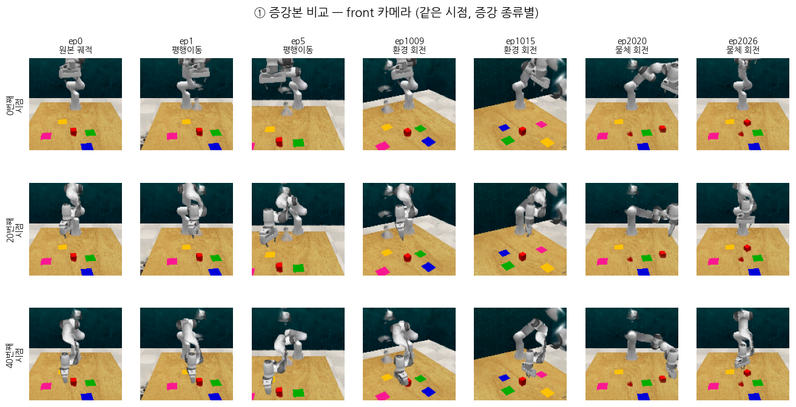
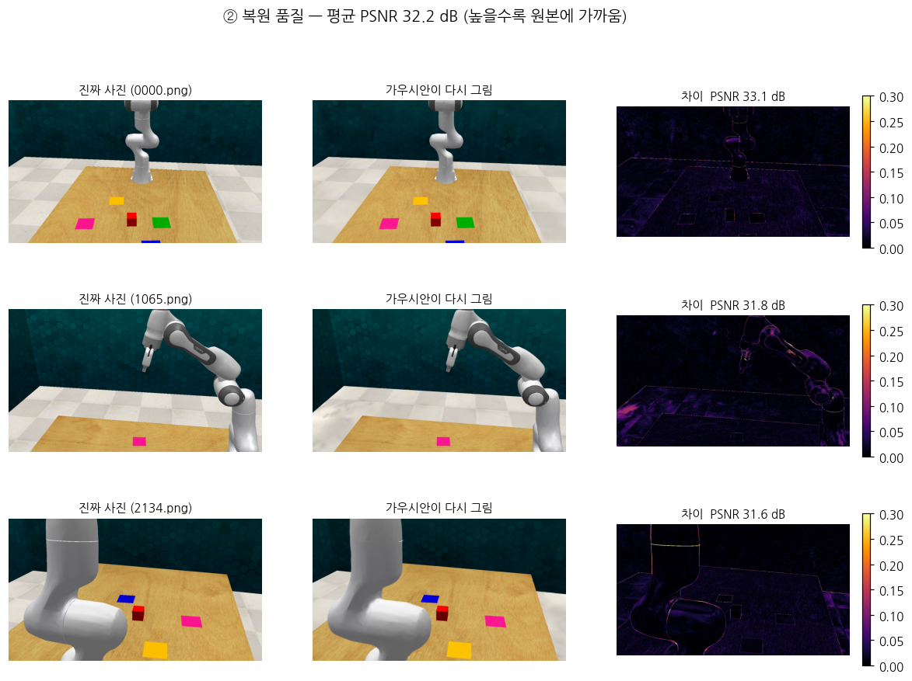

# 002. 증강 결과 검증 (M1)

작성: 2026-09-19
대상: `data/generated_data/slide_block_to_color_target_episode0_start/`
실행 로그: `run_logs/20260918_2046_m1_generate.log`

---

## 사전지식

| 용어 | 뜻 | 비유 |
|---|---|---|
| **PSNR** | 두 사진이 얼마나 같은지 재는 숫자(dB). 높을수록 똑같음 | 시험 점수. 30점대면 "잘 그렸다" |
| **증강 기각** | 만든 시범이 물리적으로 이상하면 버리는 것 | 불량품 검사 |
| **스텁** | 함수 껍데기만 있고 내용이 빈 것 | 문패만 걸린 빈 가게 |

---

## 0. 한 줄 결론

> **사진은 잘 만들어졌다. 그런데 기록표(숫자)는 절반만 고쳐졌다.**

---

## 1. 얼마나 만들어졌나

| 항목 | 값 |
|---|---|
| 에피소드 | **34개** (원본 1 + 증강 33) |
| 기각된 증강 | **3건** |
| 소요 시간 | **19분** (31초/개) |
| 용량 | 710 MB |
| 종료 코드 | 0 (정상) |

증강 종류별:

| 종류 | 계획 | 생성 | 번호 |
|---|---|---|---|
| 평행이동 | 8 | **8** | ep1~8 |
| 환경 회전 | 11 | **11** | ep1009~1019 |
| 물체 회전 | 17 | **14** | ep2020~2036 |

→ 물체 회전에서만 3건이 기각됐다. **블록을 특정 각도로 돌려 밀었더니 예상과 다른 곳으로 굴러가서** 버린 것이다. 잘못된 시범으로 로봇을 가르치지 않으려는 안전장치가 작동했다.

---

## 2. ① 증강본 비교 — 의도대로 작동함



| 증강 | 확인된 동작 |
|---|---|
| 평행이동 | 식탁·색깔판이 통째로 옆으로 이동. 로봇은 제자리 ✅ |
| 환경 회전 | 색깔판 배치 전체가 회전 ✅ |
| 물체 회전 | 색깔판만 회전, 식탁은 고정 ✅ |

**눈에 보이는 결함 2가지**

| 결함 | 원인 |
|---|---|
| 로봇 팔이 **반투명·뭉개짐** | 배경은 사진 200장으로 정밀 복원했지만, 로봇은 **미리 만든 부품 11개를 관절에 맞춰 조립**하는 방식이라 이음새가 벌어진다 |
| 공중에 **검은 얼룩** | 복원 과정에서 생긴 떠다니는 잔여 가우시안 |

> 이는 논문 방식 자체의 한계이며, 저자도 이 상태로 논문을 냈다.

---

## 3. ② 복원 품질 — 매우 좋음



**[공학적 정의]** 200장의 실제 사진으로 만든 3D 장면을, 원본 사진과 **똑같은 카메라 위치**에서 다시 그려 원본과 비교했다. 차이가 작을수록 복원이 충실하다.

**[비유]** 초상화를 같은 각도의 사진과 겹쳐 보는 것이다. 겹쳐서 어긋남이 없으면 잘 그린 것이다.

| 시점 | PSNR |
|---|---|
| 0000 | 33.1 dB |
| 1065 | 31.8 dB |
| 2134 | 31.6 dB |
| **평균** | **32.2 dB** |

→ 30 dB를 넘으면 육안으로 거의 구별이 안 되는 수준이다. **복원은 신뢰할 만하다.**

차이 지도(오른쪽 열)를 보면 **오차가 물체 가장자리에만 몰려 있다.** 넓은 면(식탁·벽)은 거의 완벽하다. 경계선이 살짝 번지는 것은 가우시안 방식의 일반적 특성이다.

> 이것이 가장 중요한 검증이었다. 복원이 나빴다면 그 위에 쌓은 증강 33개가 전부 무의미했을 것이다.

---

## 4. ③ 궤적 수치 대조 — 절반만 변환됨 ⚠️


**원본과의 최대 차이** (0이면 = 전혀 안 바뀜):

| 항목 | 평행이동(ep1) | 환경회전(ep1009) | 판정 |
|---|---|---|---|
| **손 위치·자세** | 0.150 | 1.643 | ✅ 변환됨 |
| 관절각 7개 | **0.000** | **0.000** | ❌ **원본 그대로** |
| 손가락 2개 | **0.000** | **0.000** | ❌ **원본 그대로** |
| 관절 속도 | **0.000** | **0.000** | ❌ **원본 그대로** |
| 손목 카메라 | **0.000** | **0.000** | ❌ **원본 그대로** |

코드 분석 때 예측했던 **`update_trajectory_with_current_data()` 스텁**의 영향이 그대로 확인됐다.

```python
def update_trajectory_with_current_data(self):
    #if self.trajectory is not None:
        #self.trajectory.update_with_current_data(...)
    pass          # ← 아무것도 안 함
```

> **[비유]** 무대를 30도 돌려놓고 새로 촬영했는데, **대본은 예전 것을 그대로 첨부**한 셈이다. 배우의 동선(손 위치)은 고쳐 적었지만 팔다리 각도는 안 고쳤다.

### 그림에서 보이는 증거

- **왼쪽 위**: 손 위치 경로가 증강마다 확실히 다른 곳으로 간다 → 변환됨
- **오른쪽 위**: 관절 1번 각도 곡선 4개가 **완전히 겹친다** → 변환 안 됨
- **왼쪽 아래**: 막대가 "손 위치"에만 있고 나머지는 0
- **오른쪽 아래**: 손목 카메라 차이가 **일직선 0**

### 이게 문제가 되는가

**아직 단정할 수 없다.** PerAct가 학습에 쓰는 핵심 신호는 `gripper_pose`이고 **그건 제대로 변환된다.** 관절각을 PerAct가 실제로 읽는지는 **M2에서 RLBench 변환 스크립트를 봐야** 확정된다.

다만 손목 카메라는 문제 소지가 있다. 렌더링할 때는 위치를 갱신하는데 **저장되는 기록표에는 갱신하지 않아서**, 사진과 기록표가 서로 어긋난다.

---

## 5. 그 밖에 알게 된 것

- **순환 참조가 실제로 터졌다.** 001에서 "잠재적 지뢰"로 기록해둔 문제다. `drema.environment.observer.camera`를 먼저 불러오면 실패하고, `drema.environment.builder`를 먼저 불러오면 정상이다. 기록해둔 덕에 원인 파악이 빨랐다.
- **손목 카메라 사진도 생성된다.** 렌더링이 고장났다고 알려져 있으나 파일 자체는 만들어진다. 논문은 이 카메라를 빼고 3대만 썼다.
- **RLBench 없이 증강이 된다.** 컨테이너에 RLBench가 없는데도 정상 동작했다. 증강은 PyBullet + 가우시안 렌더링만으로 이뤄진다.

---

## 요약

> **① 사진**: 증강 3종 모두 의도대로 작동. 34개 생성(기각 3건), 19분 소요.
> **② 복원**: **평균 PSNR 32.2 dB로 매우 양호.** 오차가 물체 가장자리에만 몰려 있다. 증강의 토대가 튼튼하다는 뜻이다.
> **③ 궤적**: **손 위치만 변환되고 관절각·손목카메라는 원본 그대로.** 예측했던 스텁 문제가 수치로 확정됐다.
> **다음**: 이 불일치가 PerAct 학습에 영향을 주는지는 **M2에서 RLBench 변환 스크립트를 확인**해야 판정할 수 있다.
