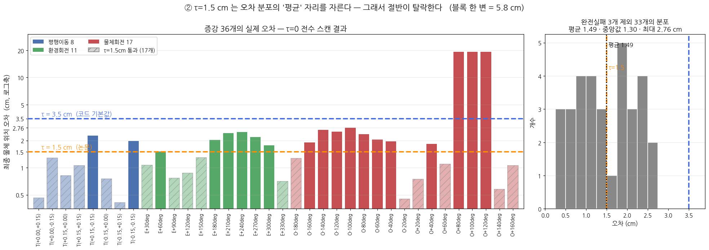
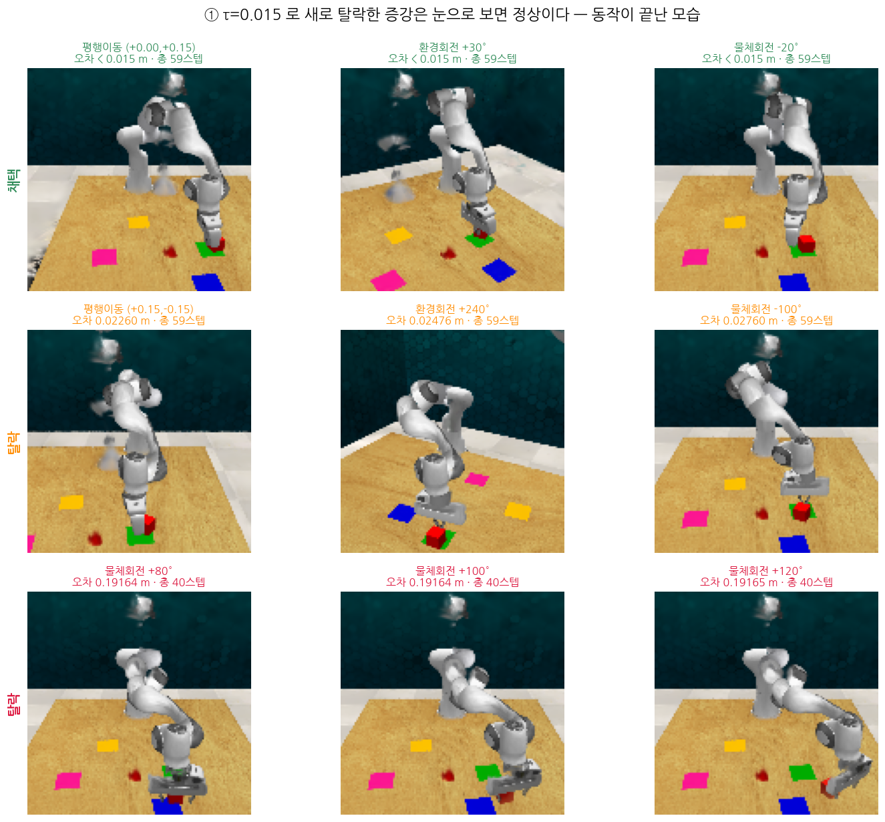
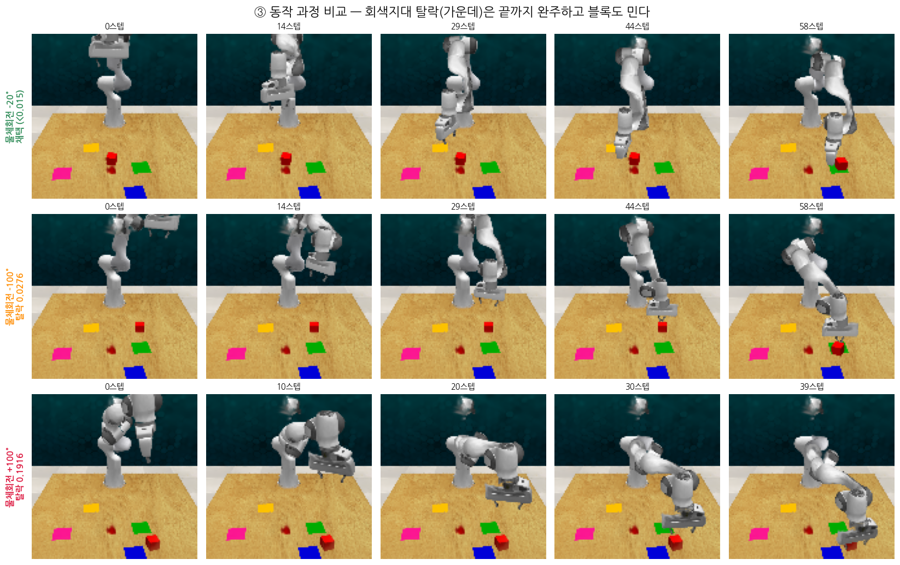

# 003. τ(검수 기준) 확정과 증강 데이터 재배치 — M2 확인사항

작성: 2026-09-19
계기: `plan/003_corrections.md` §3 의 "M2에서 확인할 것 2가지"
실행 로그: `run_logs/20260919_1525_m1_generate_tau015.log`, `run_logs/20260919_1559_m1_errorscan_tau0.log`

---

## 사전지식

| 용어 | 뜻 | 비유 |
|---|---|---|
| **증강** | 장면을 옮기고 **물리를 다시 돌려** 새 시범을 만드는 것 | 무대를 30도 돌려 놓고 **다시 촬영** |
| **τ (타우)** | 만든 시범을 **합격/불합격** 가르는 기준 거리 | 공장 검수 자 |
| **채택률** | 만든 것 중 합격한 비율 | 공장 수율 |
| **키포인트** | 그리퍼가 열리거나 닫히는 결정적 순간 | "여기서 집으세요" 지점 |

---

## 0. 한 줄 결론

> **① 궤적 스텁은 학습에 무해하다. ② 논문 τ=0.015 가 맞고, 코드 기본값 0.035 는 논문 조건이 아니다.**

---

## 1. 확인사항 ① — 궤적 스텁은 **무해**

`Data_Analysis/002` 에서 증강 궤적의 **관절각이 원본 그대로**임을 확인했다. 이게 학습을 망치는지가 미결이었다.

### PerAct 가 실제로 읽는 것은 4개뿐

```python
# PerAct  helpers/utils.py:326-341
obs.joint_velocities = None      # ← 버림
obs.joint_positions  = None      # ← 버림
robot_state = [gripper_open, 손가락1, 손가락2]   # + 타임스텝 = 4개
# launch_utils.py:33  LOW_DIM_SIZE = 4
```

변환 스크립트도 먼저 버린다.
```python
# leobarcellona/RLBench  tools/prepare_data_for_peract.py:91
joint_positions = None,          # ← 읽지도 않음
```

> **[비유]** 대본의 팔다리 각도를 안 고쳤다고 걱정했는데, **PerAct 는 그 칸을 애초에 읽지 않고 찢어 버린다.** 읽는 칸은 "손이 어디로 갈지"와 "손가락을 얼마나 벌렸는지" 뿐이다.

### 딱 한 군데 쓰이는 `joint_velocities` 도 문제없다

PerAct 는 시범 전체가 아니라 **키포인트만** 학습한다. 그 선별에 관절 속도를 쓴다.

증강 34개 전부에 PerAct 의 키포인트 탐지 코드를 그대로 돌려본 결과:

| | 결과 |
|---|---|
| 찾아낸 키포인트 | **[40, 58]** — 34개 전부 동일 |
| 40스텝의 정체 | 그리퍼 닫힘 = 블록 잡는 순간 (002 부록 B와 일치) |
| 그 지점의 **실제** 손 이동량 | 0.0014 / 0.0020 m/step → **진짜로 멈춰 있다** |

→ 베껴온 속도값이지만 **키포인트를 정확히 짚는다.** 증강은 같은 경유점 순서를 강체변환만 한 것이라 타이밍 구조가 보존되기 때문이다.

### 부수 발견

- 손가락 벌림(`gripper_joint_positions`)이 안 변한 것은 **버그가 아니라 정답**이다. 같은 블록을 잡으면 장면을 돌려도 벌림 폭은 그대로여야 한다.
- 궤적 pkl 은 60스텝인데 사진은 59장이다. 변환기가 경고를 찍고 **마지막 1스텝을 자른다**. 그 구간은 정지 상태라 영향 없다. → **M4 변환 때 경고 34번은 정상이다.**

---

## 2. 확인사항 ② — 논문 τ 는 `generation.threshold`

### 논문 원문 (arXiv 2412.14957 §4)

> ‖ l̂ᵢ − ( Rᵢ(lᵢ − P) + P ) ‖ < τ,  **τ = 0.015 meters**

| 기호 | 뜻 |
|---|---|
| lᵢ | **원본** 시범이 끝났을 때 블록 위치 |
| Rᵢ(lᵢ−P)+P | 그것을 그대로 돌려놓은 **기대 위치** |
| l̂ᵢ | 증강을 **실제로 돌려봤을 때** 멈춘 위치 |

### 코드 (`generate_new_data.py:159`)

```python
if np.max(np.linalg.norm(final_positions            # l̂ᵢ
                       - final_positions_augmented, # Rᵢ(lᵢ−P)+P
                         axis=1)) < cfg.simulation.generation.threshold:
```

**수식과 코드가 한 글자도 어긋나지 않는다.**

### 그런데 값이 다르다

| | 값 |
|---|---|
| 논문 τ | **0.015 m** |
| 코드 기본값 (`coppelia_simulation.yaml:71`) | **0.035 m** |
| M1 에서 우리가 쓴 값 | **0.035 m** |

> ⚠️ 설정에 있는 `trajectory.keypoint_threshold: 0.015` 는 **우연히 숫자만 같은 다른 것**이다.
> 그것은 **로봇 손**이 목표에 닿았는지 보는 IK 허용오차(`robot_envirionment.py:150`)다.

---

## 3. τ=0.015 로 다시 돌려 봤다 — **절반이 날아간다**

```bash
python generate_new_data.py \
  data.source_path=data/slide_block_to_color_target_episode0_start \
  simulation.visualization.visualize=False \
  simulation.generation.threshold=0.015 \
  simulation.generation.generated_data_path=./data/generated_data_tau015
```
바뀐 값은 `threshold` **하나뿐**이다.

| 증강 종류 | τ=0.035 | **τ=0.015** |
|---|---|---|
| 평행이동 | 8 / 8 | **6 / 8** |
| 환경회전 | 11 / 11 | **5 / 11** |
| 물체회전 | 14 / 17 | **6 / 17** |
| **합계** | **33** | **17** |

**탈락은 세 종류 전부에서 났다.** 물체회전에만 몰릴 거라던 예상은 틀렸다.

---

## 4. 오차를 전부 재봤다 (`threshold=0` 전수 스캔)

코드는 **합격한 것의 오차를 출력하지 않는다.** 그래서 기준을 0으로 놓아 전부 불합격시키고 36개 오차를 모두 받아냈다. (전부 불합격이므로 저장되는 파일은 없다.)



| | 값 |
|---|---|
| 완전실패 3개 제외 33개 | 평균 **1.49 cm** · 중앙값 1.30 cm |
| 범위 | 0.41 ~ **2.76 cm** |
| 완전실패 3개 | 19.16 cm |

```
 τ = 3.5 cm  ┈┈┈┈┈┈┈┈┈┈┈┈┈  ← 최대값(2.76)보다 위. 완전실패 3개만 거른다
 τ = 1.5 cm  ┈┈┈┈┈┈┈┈┈┈┈┈┈  ← 평균(1.49)과 같은 자리. 절반이 잘린다
```

> **[공학적 정의]** 임계값이 분포의 평균 근처에 있으면, 값을 조금만 움직여도 통과 개수가 크게 흔들린다.
> **[비유]** 합격선이 **점수가 가장 몰린 자리**에 걸린 시험이다. 커트라인 1점 차이로 합격자가 반이 된다. 환경회전 +60°는 1.507 cm 로 **0.007 cm 차이로 탈락**했다.

**시뮬레이션은 결정적이다.** 세 번의 독립 실행에서 같은 오차가 소수점 8자리까지 재현됐다(0.19164481 / 487 / 533). → 언제 다시 돌려도 같은 결과가 나온다.

---

## 5. 눈으로 보면 — 탈락한 16개는 **성공한 시범**이다




| | 오차 1.5~2.8 cm (16개) | 오차 19 cm (3개) |
|---|---|---|
| 과제 성공? | **성공** — 블록이 목표 판 위 | 실패 — 블록 안 건드림 |
| 스텝 수 | **59 (완주)** | 40 (중단) |
| 원인 | 판 위에서 2 cm쯤 치우침 | 로봇 팔 IK 도달 실패 |

**두 종류의 "탈락"은 질이 완전히 다르다.**

> **[비유]** 다트를 **과녁 안쪽에 맞혔지만 정중앙은 아닌 것**(16개)과, **던지지도 못한 것**(3개)의 차이다.

여기까지만 보면 *"멀쩡한 걸 왜 버리나, 0.035 가 낫다"* 는 결론이 나온다. **그건 틀렸다.**

---

## 6. 결판 — 논문 채택률과 맞춰 보면 **0.015 가 맞다**

논문 부록 원문:

> *"generates n valid examples … **61 for slide block** … Each original demonstration allows for a **maximum of 37** generated trajectories"*
> *"(five examples for each task except for **slide block … that have 4 variations**)"*

| | 원본 시범 | 유효 증강 | 원본 1개당 | **채택률** |
|---|---|---|---|---|
| **논문** | 4개 | 61개 | 15.3 | **41 %** |
| **우리 τ=0.015** | 1개 | 17개 | 17 | **49 %** ← 근접 |
| 우리 τ=0.035 | 1개 | 33개 | 33 | **92 %** ← 논문일 수 없음 |

> **논문도 증강의 약 60%를 버렸다.** 저자는 "성공해 보이는 시범"까지 버리는 것을 알면서도, 라벨 정확도를 위해 그렇게 했다.

**→ M4 학습에는 `data/aug_tau015_paper/` (원본 1 + 증강 17)를 쓴다.**

---

## 7. 남은 격차 — 원본 시범이 **1개**뿐이다

τ보다 이쪽이 크다.

| | 논문 | 우리 |
|---|---|---|
| slide_block 변형 | 4개 | **1개** |
| 원본 시범 | 4개 | **1개** |
| 증강 | 61개 | 17개 |
| **학습 데이터 총량** | **65개** | **18개** (논문의 **28 %**) |

→ 논문 수치(48.4 % / 62.0 %)보다 **낮게 나올 것이 확실하다.** 변형 3개를 추가하려면 M2 환경이 먼저 필요하다(과제당 약 1일).

---

## 8. 데이터 폴더 재배치

폴더 이름만 보고 조건을 알 수 있게 바꿨다. 자세한 것은 `data/README.md`.

```
data/
├── slide_block_to_color_target_episode0_start/   원본 샘플 · 불가침
├── aug_tau015_paper/     ⭐ M4 학습용   τ=0.015 · 18폴더
├── aug_tau035_default/      비교용      τ=0.035 · 34폴더
├── aug_rejectcheck/      ⚠️ 학습 금지
│   ├── nofilter_rotonly/    실제 데이터 (τ=999)
│   ├── tau015/              탈락 19개 → 심볼릭 링크
│   └── tau035/              탈락 3개  → 심볼릭 링크
└── eval_raw/                평가 데이터 31 GB
```

- 링크 이름에 조건과 오차가 들어 있다 → `O_rot-100deg_err0.02760`
- 옛 경로(`generated_data`, `generated_rejected_check`)는 **심볼릭 링크로 살려 뒀다.** 001·002 문서가 인용 중이다.

### ⚠️ 사고 기록 — 컨테이너가 만든 폴더는 root 소유다

하위 디렉터리로 옮기려다 권한 오류가 났고, `shutil.move` 가 **복사 후 원본 삭제**로 넘어갔다. 첫 파일에서 막혀 **손실은 없었고**, 파일 10,132개 체크섬으로 동일함을 확인한 뒤 정리했다.

> **원인**: 디렉터리를 **다른 부모**로 옮기려면 그 디렉터리 자신에 쓰기 권한이 필요하다. root 소유라 호스트 사용자에게는 없다. 같은 부모 안에서의 이름 변경은 되기 때문에 앞의 두 개는 성공했다.
> **교훈**: `data/` 안의 이동·삭제는 **반드시 컨테이너 안에서** 한다.

---

## 요약

> **① 궤적 스텁은 무해하다.** PerAct 는 관절각을 읽지 않는다 — 신경망이 받는 저차원 상태는 `[그리퍼 열림, 손가락2, 타임스텝]` **4개뿐**이다. 키포인트 탐지에 쓰이는 관절 속도도 실측 결과 **[40, 58]** 을 정확히 짚었다.
> **② 논문 τ=0.015 는 `generation.threshold` 다.** 코드 기본값 0.035 와 다르다. `keypoint_threshold: 0.015` 는 숫자만 같은 다른 것이다.
> **τ=0.015 면 증강이 33 → 17개로 반토막 난다.** 오차 전수 스캔 결과 정상 33개의 평균이 1.49 cm 라, **τ=1.5 cm 가 분포 한가운데를 자르기** 때문이다.
> **탈락한 16개는 눈으로 보면 성공한 시범이지만, 논문 채택률(41%)이 우리 τ=0.015(49%)와 일치**하므로 저자도 그렇게 버렸다. → **학습에는 `aug_tau015_paper` 를 쓴다.**
> **τ보다 큰 격차는 원본 시범 1개 vs 논문 4개**다. 학습 데이터가 논문의 28% 라 수치는 낮게 나올 것이다.

---
---

# 부록 A. 논문 PDF 원문 대조 — 정정과 새로 알아낸 것

추가: 2026-09-19
대상: `_thinking/raws/Dream to Manipulate ….pdf` (arXiv 2412.14957v2, 34쪽)
계기: 본문까지는 arXiv HTML 로 작업했는데, 사용자가 PDF 원본을 제공해 전문을 대조했다.

---

## A-1. 정정 — 채택률 수치

본문 §6 에 **"논문도 증강의 약 60%를 버렸다"** 라고 썼으나 **반대다.**

> 부록 L 원문: *"a theoretical maximum of 1369 demonstrations, but filtering reduces this to 831, **retaining approximately 60%** of the generated data."*

| | 총 가능 | 채택 | **채택률** |
|---|---|---|---|
| 논문 **전체 9과제** | 1369 (원본 37 × 37) | 831 | **61 %** |
| 논문 **slide_block** | 148 (원본 4 × 37) | 61 | **41 %** |
| **우리 τ=0.015** | 37 | 18 | **49 %** |
| 우리 τ=0.035 | 37 | 34 | **92 %** |

→ **결론은 바뀌지 않는다.** 우리 49% 는 논문의 slide_block(41%)과 전체 평균(61%) **사이**에 있고, 92% 는 어느 쪽과도 맞지 않는다. **τ=0.015 선택은 유효하다.**

---

## A-2. ⚠️ 두 번째 불일치 — `radius_filter`

τ 와 **똑같은 구조의 문제**를 하나 더 찾았다.

> 부록 L 원문: *"the depth images rendered by the Gaussians are inaccurate along the edges... This created **noisy point clouds that affected the agent**. We solve it by filtering using the **radius outlier removal from Open3D**."*

```yaml
# configs/simulation/coppelia_simulation.yaml:28
output:
  radius_filter: False     # ← False 면 Scharr 필터를 쓴다
```
```python
# drema/environment/base_environment.py:175-178
if radius_filter: depth = filter_radious_outlier(...)   # 논문이 쓴 것
else:             depth = filter_scharr(...)            # 우리가 쓴 것
```

### 왜 중요한가

```
가우시안 렌더링 → 깊이 이미지 → 3D 포인트클라우드 → PerAct 의 복셀 입력
                      ↑ 여기서 필터가 작동
```

**[공학적 정의]** 가우시안은 물체 **가장자리에서 깊이를 부정확하게** 그린다. 그대로 3D로 되쏘면 허공에 뜬 잡음 점이 생긴다.
- **Radius outlier removal**(논문): 점 주변 반경 안에 이웃이 적으면 버린다 → **3D 공간에서 판단**
- **Scharr**(코드 기본값): 2D 깊이 이미지에서 경계가 급한 픽셀을 버린다 → **2D 화면에서 판단**

**[비유]** 흐릿한 부분을 지우는 두 방법이다. 하나는 **입체 모형을 세워 놓고 혼자 떨어진 조각을 집어내는 것**, 다른 하나는 **사진 위에서 번진 윤곽선을 지우는 것**이다. 결과가 다르다.

### 영향 범위

| | 영향 |
|---|---|
| τ 채택/기각 | ❌ 없음 — PyBullet 물체 좌표로 판정. **같은 17개가 나온다** |
| RGB | ❌ 없음 |
| **깊이 → PerAct 입력** | ✅ **바뀐다** |

→ `radius_filter=True` 로 재생성해 `data/aug_tau015_radius/` 에 둔다. 로그 `run_logs/20260919_1632_m1_gen_tau015_radius.log`.

### 이미 일치하는 것 — `scale: 4`

논문: *"we rendered a higher-resolution image and down-sampled it"*
코드: `rgb[::scale, ::scale]`, `scale: 4` → 512×512 렌더 후 128×128 축소. **일치한다.**

---

## A-3. M4 학습 설정 — 논문에 전부 있다 (부록 L)

| 항목 | 값 | 비고 |
|---|---|---|
| 기반 | PerAct 원본 파라미터 | |
| **배치 크기** | **4** | 원본 크기로도 시험 → slide block 은 +1.2 차이뿐 |
| **반복** | **100k** (단일과제) | 다중과제 600k |
| **체크포인트** | **5k 마다** | 원본은 10k. *"학습 후반부 모델을 더 많이 남기려고"* 저자가 좁혔다 |
| 검증 | 5k 마다 → 최고 모델 선택 | |
| 학습 GPU | Nvidia A40 | |

> 저자의 5k 판단은 **CLAUDE.md 의 "저장 분기를 촘촘하게" 규칙과 같다.**

### 평가 프로토콜

| | 논문 | PerAct 원본 |
|---|---|---|
| 검증 세트 | **40** | 25 |
| 테스트 세트 | **50** | 25 |
| 반복 | **5회** | — |

### 카메라 — 3대 확정

> *"q̃ₛᵢₘ = q_front, q_left, q_right"* · *"radius filter... less effective with the wrist camera. Therefore, we used **three cameras instead of four**"*

**front / left_shoulder / right_shoulder**, 이미지 **128×128**. overhead·wrist 제외.
→ Code_Analysis/001 이 "손목 카메라 CUDA 하드코딩 고장"으로 추정한 것과 **이유는 다르지만 결과는 같다**(논문은 필터 효과 부족을 이유로 들었다).

---

## A-4. slide_block 목표 수치 (Table 1)

| 조건 | 성공률 (%) |
|---|---|
| PerAct (원본만) | **48.4 ± 3.20** (최고 50) |
| DreMa (상상만) | 54.4 ± 2.15 (최고 62) |
| **DreMa + 원본 (전부)** | **62.0 ± 2.19** (최고 66) |

단, 이 수치는 **원본 4개 + 증강 61개 = 65개**로 낸 것이다. 우리는 **원본 1개 + 증강 17개 = 18개**(28%)이므로 **더 낮게 나온다.**

---

## 부록 A 요약

> **정정**: 논문은 증강의 60%를 **버린 게 아니라 채택**했다(1369 → 831). 다만 slide_block 만 보면 채택률 41% 이고, **우리 49% 가 그 사이에 있어 τ=0.015 결론은 그대로**다.
> **⚠️ 두 번째 불일치 `radius_filter`**: 논문은 Open3D radius outlier removal, 코드 기본값은 Scharr. **PerAct 입력인 포인트클라우드가 달라진다.** τ 판정에는 영향이 없어 같은 17개가 나오되 깊이만 논문 방식이 된다 → `aug_tau015_radius/` 로 재생성.
> **M4 설정을 전부 확보**했다 — 배치 4 · 100k 반복 · **5k마다 저장** · 검증40/테스트50×5회 · 카메라 3대 · 128×128.
> **목표 수치**는 48.4 → 62.0 이지만, 논문은 데이터 65개, 우리는 18개다.
